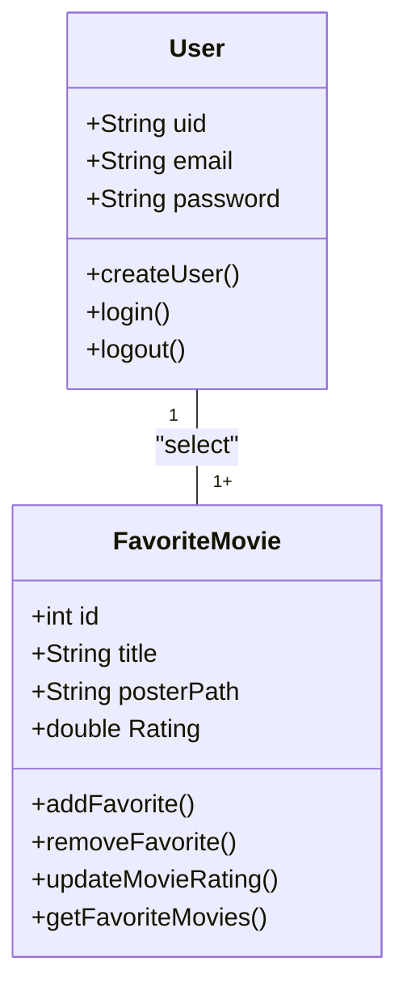

# Cine Favorite (Formativa)

Construir um aplicativo do zero - O Cinefavorite que permitirá criar uma conta e buscar filmes em uma API e montar uma galeria pessoal de filmes favoritos, com poster e nota avaliativa do usuário para o filme

## Objetivos
- Criar uma galeria personalisada por usuário de filmes favoritos
- Conectar o app com uma API (base de dados) de filmes (TMDE)
- Permitir a criação de contas para cada usuário
- Listar filmes por uma palavra-chave

## Levantamento de Requisitos do Projeto
- ## Funcionais

- ### Não Funcionais

## Recursos do Projeto
- Linguagem de programação: Flutter/Dart
- API TMDB: Base de dados para filmes
- Firebase: Authentication/FireStore
- Figma: Prototipagem
- VSCode
- GitHub

## Diagramas
1. Classe
Demonstrar o funcionamento das entidades do sistema

- Usuário (User): Classe já modelada pelo FirebaseAuth
    - Atributos: email, senha, uid
    - Métodos: login, registrar, logout

- Filmes Favoritos (FavoriteMovie): Classe Modelada pelo DEV
    - Atributos: id, titulo, PosterPath, Nota
    - Métodos: adicionar, remover, listar, atualizarNota (CRUD)

